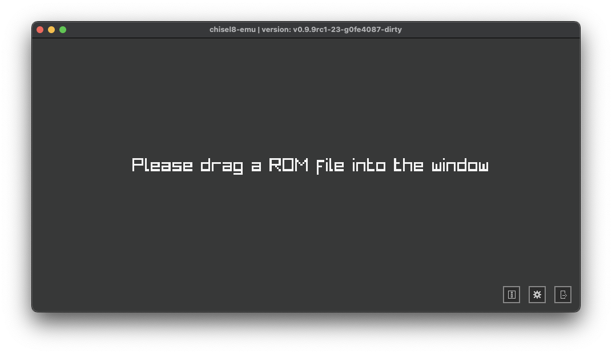
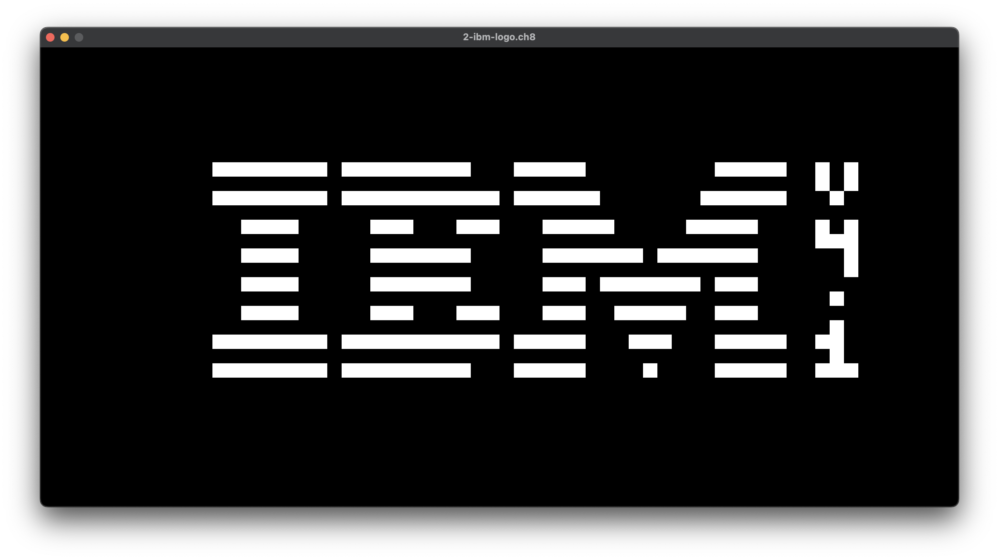
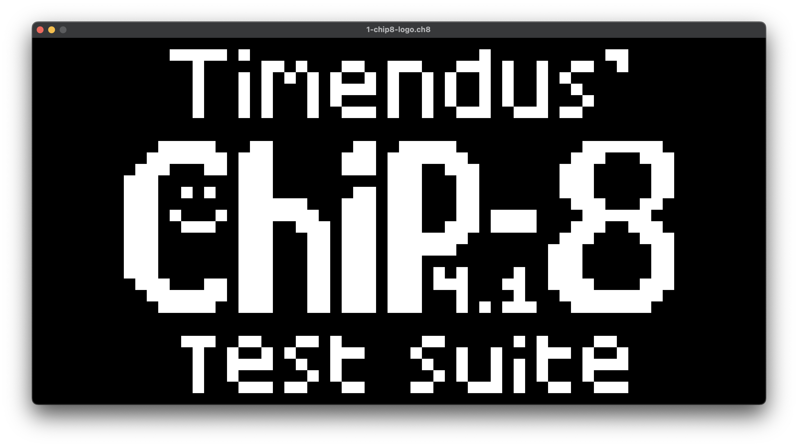
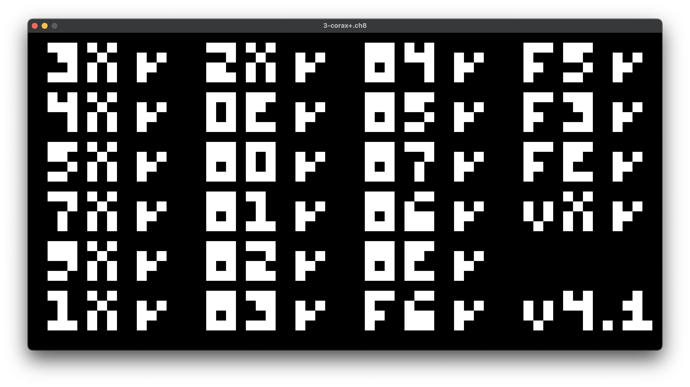
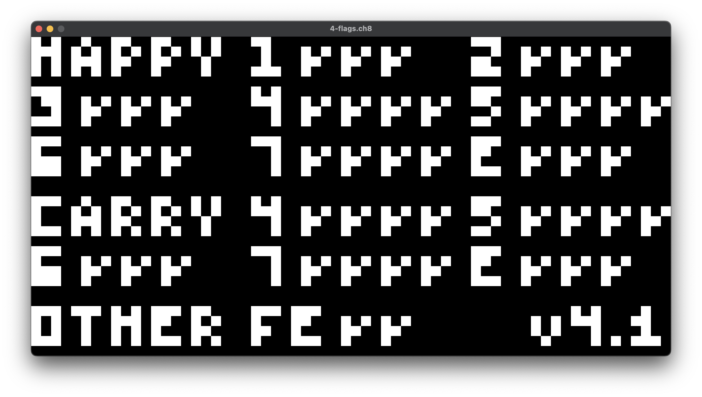
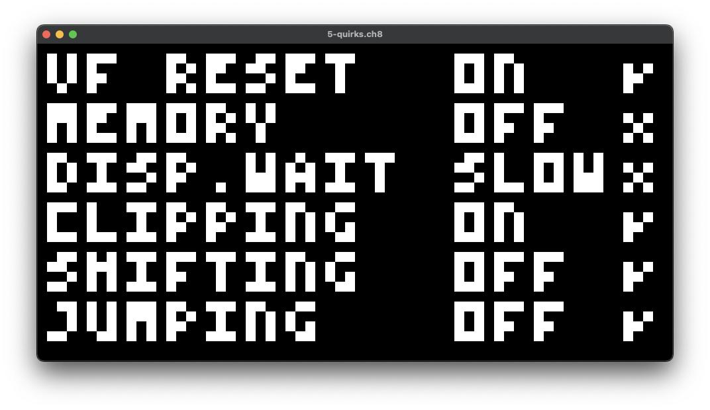

<p align="center">

</p>

Compact Hexadecimal Interpretive Programming – 8-bit (Chip-8 Interpreter), written in C with use of the [Raylib](https://github.com/raysan5/raylib) and [Raygui](https://github.com/raysan5/raygui) libraries.
Special thanks to everyone in the [EmuDev Discord Server](https://discord.com/invite/7nuaqZ2) that helped out with fixing some issues and handling undefined behaviour, as well as
the test ROMS from [Timendus's Chip8 test suite](https://github.com/Timendus/chip8-test-suite).

### Pictures
<div style="display: flex; flex-wrap: wrap; gap: 10px;">







</div>

---
Currently, all opcodes are implemented and all of them except for a few work as intended. All features can be seen in the list below:

### Features
- [X] OpenGL + optional [ANGLE](https://chromium.googlesource.com/angle/angle/+/main/README.md) support (instructions down below)
- [X] MacOS, Linux and Windows platform support. (See: [raylib: supported platforms](https://www.raylib.com/#supported-platforms))
- [X] Loading of .ch8 ROM files
- [X] Supports all opcodes for the original [Chip-8](https://emu.gulrak.net/reference/opcodes/) system
- [X] Settings to change background and pixel color values as well as the beep volume
- [X] Chip-8 Audio emulation (it's just a beep...)
- [X] Correct keypad input
- [X] Settings panel to change color, display scale and debug/FPS info in the application

```
Please report any bugs via GitHub on the issue page. Thank you!
```
---
# Build instructions

### MacOS & Linux

#### OpenGL
```zsh
git clone https://github.com/npxtune/chisel8.git
cd chisel8
git submodule update --init --recursive   # To fetch raylib & raygui
mkdir build && cd ./build
cmake -DCMAKE_BUILD_TYPE=Release ..
make -j 6 # '6' -> How many cores you want to use
./chisel8
```
That's it. Remember to install the necessary raylib + raygui [dependencies](https://github.com/raysan5/raylib/wiki) for your platform.

---
#### ANGLE
This will be a little more complex
```zsh
git clone https://github.com/npxtune/chisel8.git
cd chisel8
git submodule update --init --recursive   # To fetch raylib & raygui
```
You will now need to provide the ANGLE dylibs in `external/angle-lib/`:
```
File tree:

chisel8/
|-- external/
    |-- angle-lib/
        |-- libEGL.dylib
        |-- libGLESv2.dylib
        
    |-- raylib-stable/
    |-- raygui-stable/
    ...
```
Without these libraries, ANGLE won't be able to be loaded & compiled against.
If both of these are in their respective directory, you can continue as follows:
```zsh
mkdir build && cd ./build
cmake -DCMAKE_BUILD_TYPE=Release -DANGLE:BOOL=ON -DOPENGL_VERSION:STRING="ES 2.0" ..
make -j 6 # '6' -> How many cores you want to use
```
The ANGLE and OpenGL cmake options are important, I tried to make this work automatically
but it's wonky, so I would recommend to just include these options. When compiled, copy over
the ANGLE dylib files into the `build` dir, so it can load them. Remember to run the binary
**from the build directory!**
```zsh
./chisel8
```

---
### Windows
**Info:**    I do not own a device that runs on Windows. These instructions might not work.
If there are any issues, feel free to open an issue & PR request.

**Requirements:** 
1. Git (https://git-scm.com/)
2. MinGW-w64 (https://www.mingw-w64.org/)
3. CMake (https://cmake.org/download/)

**Follow these steps to install MinGW-w64 for Windows:** https://code.visualstudio.com/docs/cpp/config-mingw#_installing-the-mingww64-toolchain

Once complete, continue in Powershell:

```zsh
git clone https://github.com/npxtune/chisel8.git
cd chisel8
git submodule update --init --recursive   # To fetch raylib & raygui
mkdir build
cd build
cmake -DCMAKE_BUILD_TYPE=Release ..
make -j 6 # '6' -> How many cores you want to use
```

There should now be an executable called `chisel8.exe` in your build folder.
Run it and the application should open.

---
#### Copyright & Licensing
```
    Copyright (c) 2023-2024 Tim <npxtune@scanf.dev> , All rights served.
    This project is MIT licensed.
```