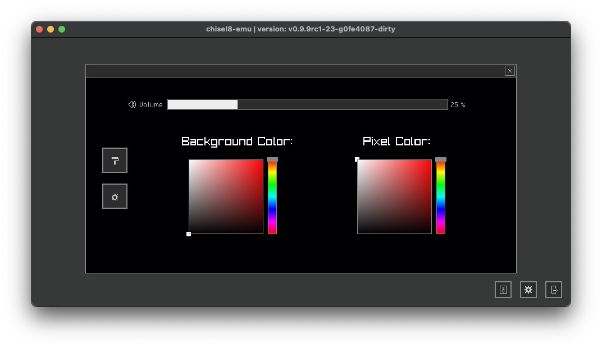

# chisel8
Compact Hexadecimal Interpretive Programming – 8-bit (Chip-8 Interpreter), written in C with use of the [Raylib](https://github.com/raysan5/raylib) and [Raygui](https://github.com/raysan5/raygui) libraries.
Special thanks to everyone in the [EmuDev Discord Server](https://discord.com/invite/7nuaqZ2) that helped out with fixing some issues and handling undefined behaviour.

Pictures:
<div style="display: flex; flex-wrap: wrap; gap: 10px;">
  
  
  


</div>

---
Currently, all opcodes are implemented and all of them except for a few work as intended. All features can be seen in the list below:

### Features:
- [X] OpenGL + optional [ANGLE](https://chromium.googlesource.com/angle/angle/+/main/README.md) support (instructions down below)
- [X] MacOS, Linux and Windows platform support. (See: [raylib: supported platforms](https://www.raylib.com/#supported-platforms))
- [X] Loading of .ch8 ROM files
- [X] Supports all opcodes for the original [Chip-8](https://emu.gulrak.net/reference/opcodes/) system
- [X] Settings.txt to change background and pixel color values as well as the display scaling
- [ ] Settings panel to change color, display scale and debug/FPS info in the application
- [ ] Loading previous ROM files for quick access via "Load ROM"
- [ ] External Debug window to show RAM contents, fetched/executed opcodes etc.
- [ ] Chip-8 Audio emulation (it's just a beep...)
- [ ] Correct keypad input (currently wonky...)


    Please report any bugs via GitHub on the issue page. Thank you!
---
# Build instructions:
### MacOS & Linux:
```zsh
git clone https://github.com/npxtune/chisel8.git
cd chisel8
git submodule update --init --recursive   # To fetch raylib & raygui
mkdir build && cd ./build
cmake -DCMAKE_BUILD_TYPE=Release ..
make -j 6 # '6' -> How many cores you want to use
./chisel8
```
That's it. Remember to install the necessary raylib + raygui [dependencies](https://github.com/raysan5/raylib/wiki) for your platform.


---
### Windows:
No idea, good luck. If you figured it out, let me know per PR. Probably something similair to the steps above.

---
    Copyright (c) 2023 Tim <npxtune@scanf.dev> , All rights served.
    This project is MIT licensed.